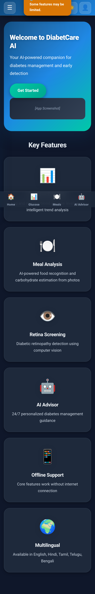
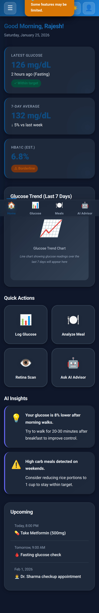
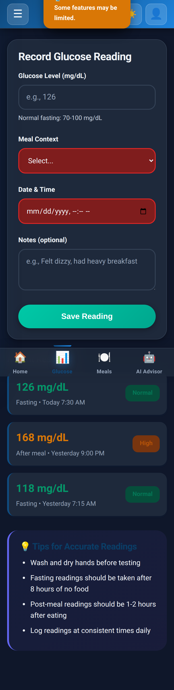
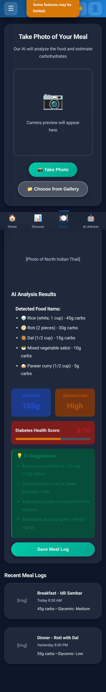
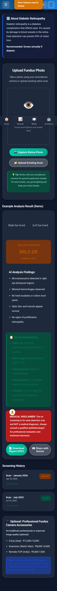
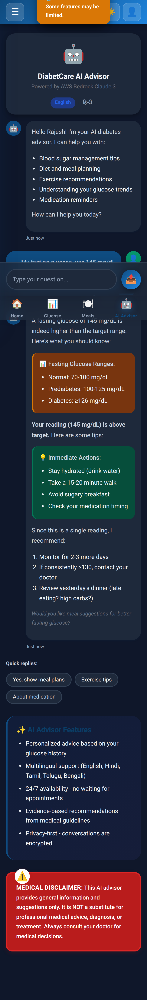

# Mobile App Screenshots

High-resolution mobile screenshots of DiabetCare AI wireframes at 390x844px (iPhone 12/13 viewport).

## Screenshots Gallery

### 01 - Landing Page

**Features:** Hero section, value propositions, feature highlights

---

### 02 - Dashboard

**Features:** Glucose stats, trend chart, quick actions, AI insights, reminders

---

### 03 - Glucose Tracker

**Features:** Manual entry form, reading history, trend indicators

---

### 04 - Meal Analyzer

**Features:** Photo upload, AI food detection, carb estimation, health scoring

---

### 05 - Retina Scan

**Features:** DR screening, fundus image upload, AI risk assessment, clinical recommendations

---

### 06 - AI Advisor (Chatbot)

**Features:** Conversational AI, diabetes guidance, quick replies, 24/7 support

---

## Usage in README

To embed these screenshots in your main README.md:

```markdown
## App Screenshots

<div align="center">
  
  
  
</div>

<div align="center">
  
  
  
</div>
```

## Technical Details

- **Viewport:** 390x844px (iPhone 12/13)
- **Scale Factor:** 2x (Retina display)
- **Format:** PNG (high-resolution)
- **Type:** Full-page (complete scrollable content)
- **Total Size:** ~3.4 MB (all 6 screenshots)
- **Capture Tool:** Puppeteer (Chrome headless)
- **Source:** HTML wireframes in `docs/` folder
- **Features:**
  - `fullPage: true` - Captures entire scrollable page
  - `captureBeyondViewport: true` - Includes content beyond viewport
  - Mobile user agent for accurate rendering
  - 2-second wait for JavaScript to load

## Regenerating Screenshots

To recapture full-page screenshots after making changes to wireframes:

```bash
# Make sure you're in the project root directory
cd /home/rajesh/ai-for-bharat-2

# Run Puppeteer screenshot capture
node capture-fullpage-screenshots.js
```

This will regenerate all 6 full-page screenshots in this folder.
